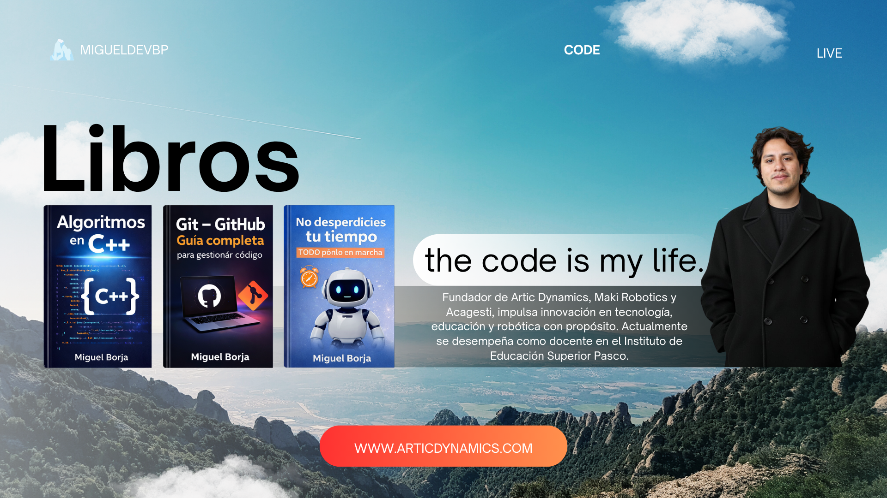

  

<h1 align="center">¡Hola! 👋 Soy Miguel Borja</h1>
<h3 align="center">Developer • Educador • Fundador de startups tecnológicas</h3>

  
  
  
  

---

## 🚀 Sobre mí

Soy **Miguel Borja**, apasionado por la tecnología, la educación y la innovación.  
Trabajo en el desarrollo de soluciones digitales, formación tecnológica y proyectos con impacto social.

- 🏢 Fundador de **Artic Dynamics**
- 🤖 Fundador de **Maki Robotics**, startup enfocada en **prótesis biónicas**
- 🧪 Impulsor de **Technology Lab**
- 🌐 Parte de **ACAGESTI**
- 🎓 Docente y promotor de formación tecnológica
- 📺 Creador de contenido en **Miguel Borja Academy**
- 💻 Enfocado en desarrollo de software, educación digital, automatización e innovación

---

## 🌍 Ecosistema de proyectos

### 🔹 Artic Dynamics
Startup orientada a soluciones tecnológicas e innovación digital.  
🔗 [www.articdynamics.com](https://www.articdynamics.com)

### 🔹 Technology Lab
Espacio orientado a experimentación, desarrollo e innovación tecnológica.  
🔗 [technologylab.articdynamics.com](https://technologylab.articdynamics.com/)

### 🔹 ACAGESTI
Organización de la que formo parte, vinculada al desarrollo y gestión profesional.  
🔗 [www.acagesti.com](https://www.acagesti.com)

### 🔹 Maki Robotics
Startup centrada en el desarrollo de **prótesis biónicas** y tecnología con impacto humano.  

### 🔹 Miguel Borja Academy
Canal donde comparto contenido educativo, incluyendo mi primer curso de programación en **C++**.  
🔗 [YouTube - Miguel Borja Academy](https://www.youtube.com/@MiguelBorjaAcademy)

---

## 🛠️ Tecnologías y herramientas

  

---

## 📊 Estadísticas de GitHub

  
  

  

---

## 📌 En lo que estoy trabajando

- 🚀 Desarrollo de plataformas y soluciones web
- 🤖 Innovación aplicada a prótesis biónicas con **Maki Robotics**
- 🎓 Contenido educativo sobre programación y tecnología
- 🌐 Expansión de proyectos digitales desde **Artic Dynamics**
- 🧪 Ideas y experimentos tecnológicos en **Technology Lab**

---

## 📫 Conecta conmigo

  
  
  
  

---

  Construyendo tecnología, educación e innovación con propósito 🚀

